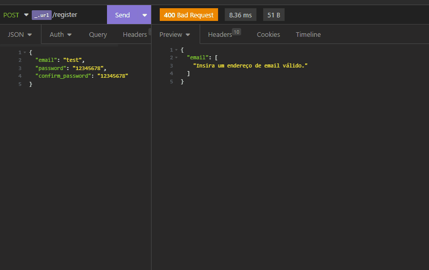
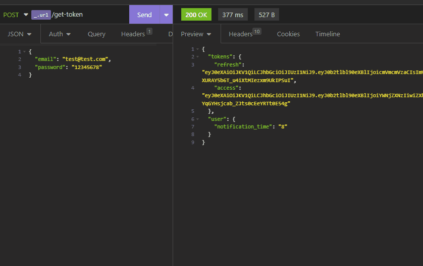
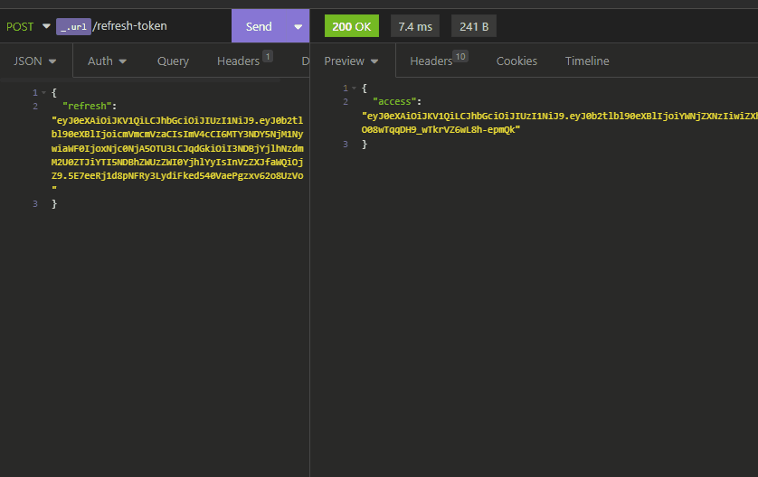
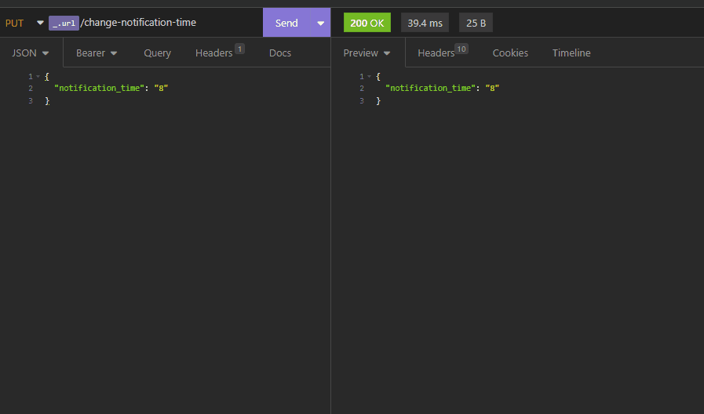
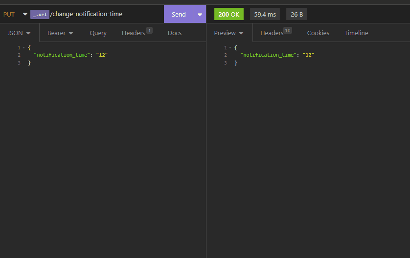
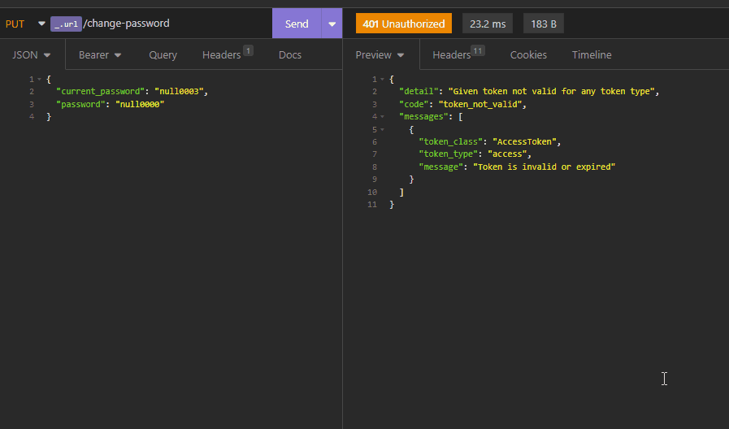
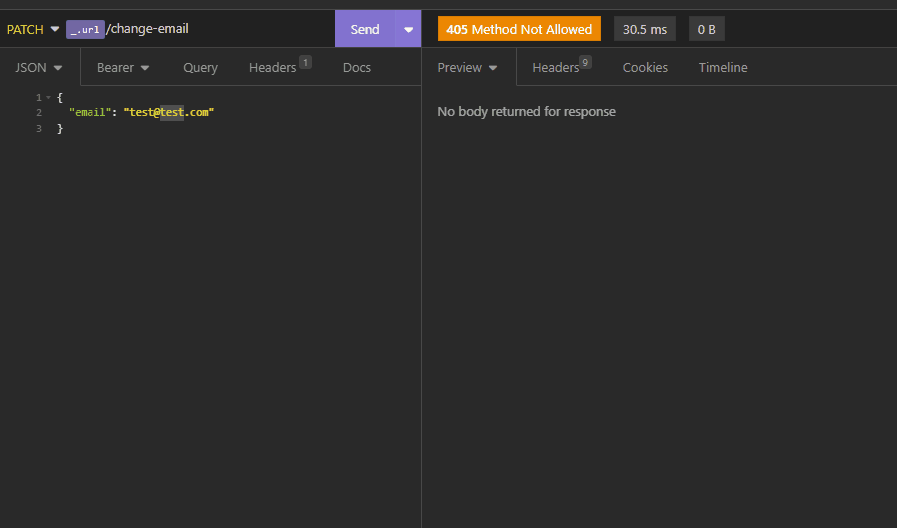
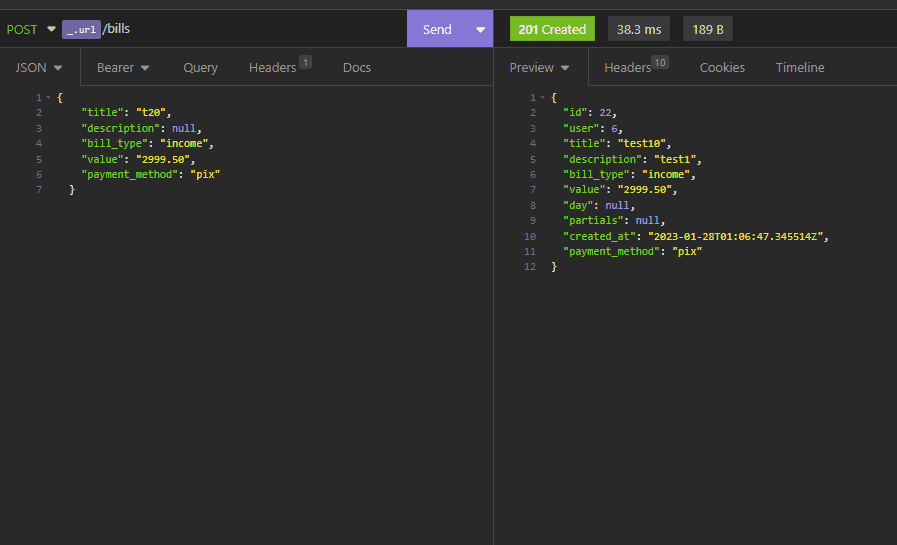
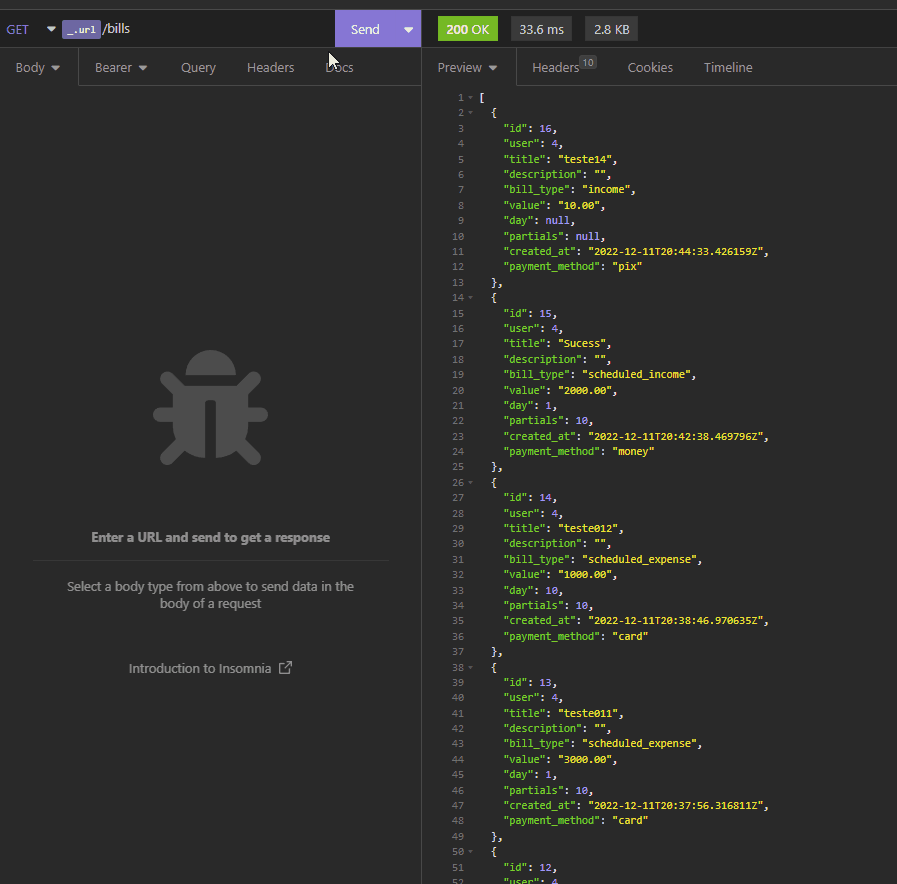

<h1>Coin-Backend</h1>

<h2>🔗 Tópicos</h2>
<ul>
<li><a href="#about">Sobre</a></li>
<li><a href="#tools">Ferramentas</a></li>
<li><a href="#db">Banco de dados</a></li>
<li><a href="#routes">Rotas</a></li>
</ul>

 
<h2 id="about">📖 Sobre</h2>

    Este é um projeto para controle financeiro, aqui contém apenas o back-end. Acesse o repositório front-end em: <a href="https://github.com/dhomini-rabelo/Coin-Frontend">https://github.com/dhomini-rabelo/Coin-Frontend</a>.

<h3 id="organization">Organização</h3>
<ul>
<li>
Os apps estão na pasta backend
</li>
<li>
A pasta COIN é onde está a configuração do projeto
</li>
</ul>

 
<h2 id="tools">🛠️ Ferramentas</h2>

<ul>
<li>Django</li>
<li>Django Rest Framework</li>
<li>Django signals</li>
<li>django-cors-headers</li>
<li>simplejwt</li>
<li>Fast</li>
<li>Redis</li>
</ul>

 
<h2 id="db">🏷️ Modelagem do banco de dados</h2>

<h3>User</h3>
<ul>
<li>username</li>
<li>password</li>
<li>name</li>
<li>email</li>
<li>notification_time</li>
</ul>

<h3>Bill</h3>
<ul>
<li>user</li>
<li>title</li>
<li>description</li>
<li>bill_type</li>
<li>value</li>
<li>payment_method</li>
<li>day</li>
<li>partials</li>
<li>created_at</li>
</ul>

 
 
<h2 id="routes">🌐 Rotas</h2>

<ul>

 
<li>
    <h3>Cadastro - "/api/register"</h3>
    
</li>

 
<li>
    <h3>Autenticação JWT - "/api/get-token"</h3>
    
</li>

 
<li>
    <h3>Atualizar token - "/api/refresh-token"</h3>
    
</li>

 
<li>
    <h3>Sem autenticação</h3>
    
</li>

 
<li>
    <h3>Atualizar horário de notificação - "/api/change-notification-time"</h3>
    
</li>

 
<li>
    <h3>Atualizar senha - "/api/change-password"</h3>
    
</li>

 
<li>
    <h3>Atualizar email - "/api/change-email"</h3>
    
</li>

 
<li>
    <h3>Cadastrar conta - "/api/bills"</h3>
    
</li>

 
<li>
    <h3>Listar contas - "/api/bills"</h3>
    

        Esta API faz o cache das contas enquanto nenhuma conta for alterada, excluída ou adicionada para esse usuário, esse controle só é possível através do Django signals.   
        <strong>Classe que faz o controle do cache (CacheController) e uma instância (bill_cache):</strong> "project/Core/controllers/cache.py" 
        <strong>Api que usa o cache com um decorator (BillListCreateAPI):</strong> "project/backend/bills/api/bills.py" 
        <strong>Signals que remove o cache (renew_bill_cache):</strong> "project/backend/bills/app/signals.py" 
    

    
</li>

</ul>